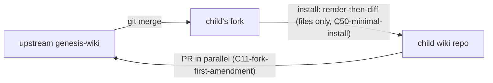

# The Genesis Contract, v1

This document is the reference law for every llm-wiki born from or adopted into the genesis system. Three audiences: agents operating in-wiki, humans reading in Obsidian or a shell, CI enforcing gates. It materializes into every child wiki; a bare reader with `rg` and this file can learn the whole shape.

**Amendment rule for this document itself:** it is contract-owned (manifest-listed). It changes only through the fork-first flow (C11-fork-first-amendment, C12-no-change-note-no-merge). **Clause numbers are append-only** — a retired clause is marked `RETIRED (superseded by C<n>-<slug>)`, never renumbered, never deleted; external references to clause numbers must stay valid forever. Every clause's identifier is the **fused one-word form `C<n>-<slug>`** — number and stable slug joined by a hyphen, never spaced apart, never the bare number; cite the whole token per C39-clause-citation.

## Glossary (terms defined once; clauses link here — each entry is one plain sentence a newcomer can parse cold)

- **upstream** — the one public genesis-wiki repo everyone converges on; it holds the reference version of the law.
- **fork** — your wiki's own copy of upstream (an ordinary git fork) where your law changes land first, before being offered back.
- **child wiki** — an actual operating wiki (home, coscene, …): a plain repo you can read with no tools installed.
- **pin** — *(retired term, v1.1)* the machine-tracked genesis pin died with the minimal-install reframe; a wiki's genesis provenance is its human-readable birth commit message (C6-manifest). The C24-reference-classes *provenance pin* for cross-wiki citations is a different thing and survives unchanged.
- **manifest** — *(retired term, v1.1)* the old GENESIS.md file list; superseded by template membership (C6-manifest) — kept here so old citations still parse.
- **template** — the two trees genesis renders and installs (C49-upstream-layout): `seeds/*` (minus the seeds README) landing at the child's root, plus `domains/contract/genesis-contract/*` mirrored 1:1.
- **install** — the one operation (C50-minimal-install): render the template → clean birth if the target is empty, adjudicated per-file diff if it is an existing wiki; re-run to update.
- **materialize** — physically copy the contract's files out of the fork checkout into the wiki, so a bare reader finds them on disk.
- **seed** — a file genesis creates once at birth; its content is yours from the first second.
- **contract-owned / instance-owned** — shipped by the template = the contract's file (an install re-run may re-propose it); anything else = yours (never touched, never proposed for removal); there is no third state (C6-manifest).
- **blind-regen** — pure file replacement gated on the old hash, no agent reads content — the opposite of backfill.
- **backfill** — a change to YOUR authored pages that an amendment requires; an agent does it with eyes open, never as a blind copy.
- **wiki-slug** — the wiki's one name: repo name = folder name = Obsidian vault name. **Wiki context ONLY** — unrelated to (and never mixed with) ucc session slugs or domain slugs; "slug" anywhere in this contract means wiki-slug.
- **repos_root** — the fixed folder every wiki lives under on every machine: `$CCC_LLM_WIKI_REPOS_ROOT/<wiki-slug>`.
- **provenance pin / nav link** — the two kinds of cross-wiki reference: a frozen citation carrying a commit, versus a clickable link to the live page (C24-reference-classes).
- **tiers** — the three moments checks run: while writing, before pushing, and on periodic audit (C32-enforcement-tiers).
- **companion repo** — a separate repo beside a wiki, named `<wiki-slug>-<purpose>`, holding what must not live in the wiki itself (sessions, assets, secrets); its own vault, its own privacy role, its own lint policy (§10).

## §1 Posture

- **`C1-thin-upstream` — Thin upstream.** Genesis ships contract text, checks, and computed-surface definitions. Never content, never a runtime, never shared code. *Why:* anything thicker turns every amendment into a framework migration.
- **`C2-born-once-commit-stream` — Target guard: born once into emptiness, adjudicated thereafter.** *(Slug kept per C39-clause-citation.)* The engine (C14-pin-writes-cli-owned) git-inits a target only when it is missing or an empty directory. An existing git repo is never re-born — it takes an adjudicated install run (C50-minimal-install), and only from a **clean tree** (`git status --porcelain` empty; untracked counts as dirty — an abandoned adjudication is just a dirty tree this guard reports). A non-empty target that is not a git repo is refused outright. Birth scaffolds once and the result is immediately instance-owned; a template git-merge into the wiki stays banned (C3-two-repo-rule).

## §2 Topology & residence

- **`C3-two-repo-rule` — Two-repo rule.** The child wiki repo never merges genesis git history. The fork absorbs upstream via ordinary `git merge` (conflicts resolved there, natively). The wiki receives only **rendered files**: the C50-minimal-install install renders the fork checkout's template and diffs it against the target — no git objects and no history cross the boundary.
- **`C4-fork-residence` — Fork residence.** Each child has its own fork — its operative law. It registers in the child as a git source (role `genesis-upstream`), checkout at `repos_root/<child-slug>-genesis`. The sources entry carries provenance and catalog visibility only; **a wiki's genesis provenance is its birth commit message (C6-manifest)** — one owner per fact.
- **`C5-skill-less-floor` — Materialization & the skill-less floor.** Operational contract artifacts materialize into every child: the wiki is a self-describing plain repo. Skill-less READ (and human Obsidian edit) is a *requirement*; skill-less governance (validate/upgrade/mutate) is a *non-goal*.
- **`C6-manifest` — No manifest, no pin chain: provenance is prose.** *(Slug kept per C39-clause-citation; the GENESIS.md manifest file and the machine-tracked pin are both retired.)* Install renders from the template (C50-minimal-install); nothing maintains a machine-readable link between a wiki and a genesis commit. A wiki's genesis provenance is the **human-readable birth commit message** — `birth: <slug> from genesis@<sha>` — reference prose for a reader, never a detection mechanism. Ownership needs no file list: what the template ships is the contract's to re-propose on the next install run; everything else in the target is instance content — never touched, never listed, never proposed for removal; **no third state**.
- **`C7-hash-gate` — Render-then-diff + adjudication.** *(Slug kept per C39-clause-citation; the blob-SHA gate retired with the manifest — the diff is now the license check.)* Every install renders the template into a private tmp tree (substitutions applied **before** diffing) and classifies every template path against the target: `ADDED` and `CHANGED` (safe classes — copied); `CHANGED-ROOT` — the **diverged-root refuse class** (`SCHEMA.md`, `CLAUDE.md`, `meridian.yaml`, `.gitignore`, `.gitleaks.toml`, `lefthook.yml`): loud per-file rows with **frontmatter-field deltas called out symmetrically** — changed, removed-by-accept, and added-by-accept keys, plus a body-differ marker (never an empty delta that could mask a destructive accept) — **refuse-by-default**, each file accepted explicitly per run, never group-accepted. **`LLM_WIKI.md` and the fork-source page `sources/git/<slug>-genesis/<SLUG>-GENESIS.md` are excluded from overwrite entirely** — both are instance-owned (LLM_WIKI.md identity per C9-schema-governed-exceptions; the fork-source page carries human `delta:` provenance notes per C4-fork-residence), rendered once at birth and never re-rendered or re-proposed on a re-install; slug/role/fork-URLs are read from them read-only. A **symlink at any template-managed path is refused** (C23-no-mounts) — the engine never writes through one. **There is no removal class**: a target file the template does not ship is instance content by definition (C6-manifest). Never a silent clobber: the adjudicating agent is the gate.
- **`C8-seed-class` — Seed class = the template payload.** The template is two trees: `domains/contract/seeds/*` (minus the seeds README) landing at the child's root, plus `domains/contract/genesis-contract/*` mirrored 1:1 (C49-upstream-layout). Seed content is the instance's from the first second; a later install run re-proposes template content through the C7-hash-gate diff (safe classes copy; diverged roots refuse) — the wiki's committed state is what adjudication defends. Teaching placeholders in the example domain stay verbatim (regression-locked). `decisions/` is ONE flat directory; state is the frontmatter `status:` toggle, never folder location (C49-upstream-layout). No birth-time SHA bookkeeping: "what did birth ship" is answered by the template trees at the sha named in the birth commit message.
- **`C9-schema-governed-exceptions` — Schema-governed exceptions.** `LLM_WIKI.md` is instance-owned but carries a contract-governed block (`reference-wikis`, C21-reference-block). Its governance is schema-shaped (meridian write-time validation), never hash-shaped; it is never manifest-listed. Same pattern for anything living in `.obsidian/` (Obsidian rewrites it; hashes cannot hold there).
- **`C10-fork-history-immutable` — Published fork history is immutable.** No rebase, squash, or force-push on published fork branches: birth-provenance shas (C6-manifest, C50-minimal-install), provenance citations (C24-reference-classes), and upstream merges depend on stable history.

## §3 Amendment & evolution

- **`C11-fork-first-amendment` — Fork-first amendment.** A contract change lands in the child's fork; the child rematerializes and moves on, never blocked by upstream. A PR to upstream opens in parallel — convergence is a duty, not a gate.
- **`C12-no-change-note-no-merge` — No change-note, no merge.** Every commit touching contract-owned paths carries git trailers: `Change-note:` (required), plus `Blind-regen:` / `Backfill:` / `Backfill-doc:` as applicable, and optionally `Decision-template:`, `Verify:`, `Breaking:`, `Deadline:`, `Severity:`. Upstream CI blocks contract-path diffs without them. **The trailer set is the migration doc** — every amendment is born with its migration.
- **`C13-pin-selected-authority` — RETIRED (superseded by C50-minimal-install).** There is no pin chain to select authority. The fork remains the child's operative-law source (C4-fork-residence, C11-fork-first-amendment) — what a wiki runs is what its last adjudicated install run copied in, and its genesis provenance is the birth commit message (C6-manifest).
- **`C14-pin-writes-cli-owned` — Executor-page-owned.** *(Slug kept per C39-clause-citation; both the compiled CLI and the pin write it owned are retired.)* The birth+install engine is a **literate `md run` page** — `INSTALL.md` at the genesis root (C49-upstream-layout), tasks `^check` / `^install` / `^bootstrap`. The page owns the mechanics (target guard, render, diff, safe-class copy, hook install) and the idempotency (re-run to update: stateless re-render + re-diff from scratch); its interface is **positional args** (`target, params-file?, accept-root?`), never env vars — the only declared env var is `^check`'s `CCC_LLM_WIKI_PATH` target-resolve guard, and install blocks run under a scrubbed env. `^install` **never commits**: the adjudicating agent reviews the dirty tree and commits. `^bootstrap`'s birth commit is the one scripted exception — through the role hook, `--no-verify` banned.
- **`C15-two-hop-upgrade` — RETIRED (superseded by C50-minimal-install).** The checkpointed trailer-walk ingest is not a contract operation anymore. Fork sync remains an ordinary git merge in the fork (C3-two-repo-rule); updating a wiki is an install re-run.
- **`C16-backfills-never-blind` — Backfills are never blind.** Authored-content changes are per-wiki agent work; below-confidence rewrites park in the decision queue (C34-decision-queue-lapse).
- **`C17-compat-window` — RETIRED (superseded by C50-minimal-install).** The skew-window machinery (floor commits, write-refusal by pin distance, skew banners) presumed a pin chain and a fleet of children at varying skew — neither exists. The surviving concern — ucc-skill vs contract-version compatibility — is **deferred, not built speculatively** (the same one-genesis-no-children logic as the v1.1 cut).
- **`C18-release-channel` — RETIRED (superseded by C50-minimal-install).** GENESIS-PIN handshakes, materialized `min-ucc`, and ancestor-check preflights died with the pin chain (C6-manifest, C50-minimal-install). The surviving concern — a ucc release declaring which contract version it understands — is **deferred** until there is a fleet to version against.
- **`C19-deadline-machinery` — Deadline machinery.** `Deadline:`/`Severity:` trailers activate it. Baseline is lazy-on-touch; a watchdog sweep + an owned fleet-run walk `repos_root/*` per host (enumeration is local; credentials are needed only to act). One report row per wiki: pass / REFUSED / UNREACHABLE. Never silence.

## §4 Identity & federation

- **`C20-slug-identity` — Slug identity, no mint.** `slug = repo name = repos_root dirname`, claimed in the wiki's own `LLM_WIKI.md` frontmatter (`wiki-slug:`) at birth. Same slug bound to two git URLs anywhere in reach = ERROR. No central registry exists; the fleet view is a computed per-host walk, cached only as an as-of-stamped observation.
- **`C21-reference-block` — Reference block.** `LLM_WIKI.md` frontmatter carries **`wiki-role:` (this wiki's own role)** beside `reference-wikis`: ordered entries `{slug, git, role}` — order is precedence; no paths, no pins (contract lineage is C6-manifest's job). One parser (meridian) validates both write-time. Roles form a one-way privacy ladder **`private > team > public`** (`public` is the most-public end — genesis entries use `role: public`). A role names the *information boundary* — who may read, and the repo's writing voice — never scope or topology (that is why there is no `project` role). A wiki may reference equal-or-more-public wikis, never the reverse — enforceable per-block only because `wiki-role:` names the referencing side. The role also mechanically selects the repo's lint pack (C45-role-selects-lint-pack). Absent block = valid (standalone wiki); present-but-unparseable = ERROR.
- **`C22-realpath-coherence` — Fixed location + realpath coherence.** Every wiki resolves at `repos_root/<slug>` per host; vault name MUST equal slug. Where both a registered vault and `repos_root/<slug>` exist: `realpath(vault) == realpath(repos_root/<slug>)` — symlink in either direction satisfies it; **two distinct copies = ERROR** (audit-truth and click-truth split-brain). No registered vault (agent-only host) = fine.
- **`C23-no-mounts` — No mounts.** No in-vault symlinks, no sync daemons, no snapshot commits. `foreign/` is reserved namespace with an emptiness lint. `wiki sync <slug>` owns ensure-checkout (clone-if-absent at `repos_root/<slug>`; never shallow — blob-filtered OK).
- **`C24-reference-classes` — Two reference classes, one generator.** *Provenance:* `wiki://<slug>/<path>@<commit>` — frontmatter-first as a bare scalar; in body as an inert literal, optionally wrapped as a nav link (drift-checked). Reconstruction: `git -C repos_root/<slug> show <commit>:<path>` — the pin survives anything. *Navigation:* `[display](obsidian://advanced-uri?vault=<slug>&filepath=<path>)` — **meridian-generated only** (`md fix` is the only percent-encoder). The canon defines both the encoding AND the **action selection, deterministically**: fragment present → `advanced-uri`; no fragment → `obsidian://open`. Same input, same output, always — heading/block precision is SHOULD (plugin seeded, doctor-checked, never hash-gated).
- **`C25-ingest-not-reference` — Ingest-not-reference.** The only content flow between wikis is harvest-ingest; the local copy carries the knowledge. Citations bind to immutable tiers (sources/, logs, archives) or the target's domain-index page — never deep evolving leaves.
- **`C26-cross-wiki-audit` — Cross-wiki audit.** My-side (URI edits): pre-push, O(my delta). Their-side (target renames): periodic audit — v1 stateless stat-sweep, findings stamped `as-of:<target-HEAD>`; watermark cursor reserved for scale. Referenced-but-absent repo = ONE finding ("not cloned on this host"), per-URI checks skip that slug. Breakage files as decision pages in the *citing* wiki; no rename propagation.

## §5 Scale & enforcement

- **`C27-prescription-authored` — Prescription authored, description computed.** Enumerations of live state (rosters, counts, catalogs, listings) inside authored pages are violations — embed a computed view instead. Linted enforce-on-new, warn-on-legacy; the lint runs over wikis AND the skill tree. *Why:* migration debt concentrates 100% in authored prose; computed surfaces re-derive free.
- **`C28-computed-surfaces` — Computed surfaces are pull-on-demand caches.** They re-derive from frontmatter + paths (greppable ground truth) and never load at O(corpus). Any index layer (duckdb, datalake) is a rebuildable cache behind a seam — instance-adoptable, never contract.
- **`C29-partition-or-exempt` — Partition or be exempt.** Every unbounded-growth dir declares a partition scheme in SCHEMA (hive `year=/month=` is the model). Post-trio, the primary partition surface is the `-sessions` companion (§10).
- **`C30-raw-tier-exemption` — Raw-tier exemption.** Raw tiers are never full-scanned by blocking checks. This is contract, not tolerance. Wiki-side the raw tier is `inbox/` (plus `sessions/` only until its companion cutover, C47-cheap-cutover); post-cutover the raw-tier posture attaches to the companion as a *repo boundary* with its own role-selected pack — strictly cleaner than a path exemption. The exemption covers scan *cost* classes only — it never exempts wikilink integrity (C42-wikilink-is-a-claim): there is no tier where a broken link is acceptable.
- **`C31-injection-budget` — Injection budget.** Skill-load injection: pulse ≤ 2K tokens inside a ≤ 10K total cap; catalogs pull-on-demand. "What changed since my last visit" = git delta — O(delta), no stored per-agent state.
- **`C32-enforcement-tiers` — Three enforcement tiers.** Write-time: blocking, touched files only (frontmatter validity, tag format, clause lints on new pages). Pre-push: blocking, O(delta) (zero net-new broken wikilinks, contract hash verify on manifest paths, aggregate invariants). Periodic audit: non-blocking, bounded, owned output (staleness/contradiction, cross-wiki URIs, orphans, decision decay) — findings land as owned decision pages or top-N reports, never warning dumps.
- **`C33-blocking-or-nonexistent` — A check is blocking or it doesn't exist.** Every warn-class rule carries an expiry: graduate to error or be deleted. The ratchet is enforce-on-new / warn-on-touch — never a retroactive warning bomb.
- **`C34-decision-queue-lapse` — Decision queue = objection window.** The action already happened; pending is the window. Machine stubs: TTL ~90d, resurrectable. Human decisions: age surfaces in DIGEST, never closed by silence into rejection — expiry closes to **`lapsed`** (action stands, explicitly unreviewed, never deleted). `severity: high` never lapses — it escalates to C19-deadline-machinery. Decisions whose referenced paths vanished auto-close `obsolete-by-structure`.

## §6 Fork discipline

- **`C35-pin-reachable-contract-only` — Pin-reachable history is contract-only.** *(Slug kept per C39-clause-citation; "pin-reachable" now reads "reachable from any sha a birth commit message names".)* Every commit reachable from a sha named in any wiki's birth-provenance record (C6-manifest, C50-minimal-install) carries contract amendments only — never instance experiments, content, or scratch work. Scratch *branches* on the fork are git-native and unbannable (C10-fork-history-immutable protects published branches only); what is banned is scratch entering that reachable history. *Why:* upstream merges and anyone resolving a birth-provenance sha must be able to trust every commit they traverse.

## §7 Birth & adoption

- **`C36-adoption-ritual` — RETIRED (superseded by C50-minimal-install).** The separate inventory/classify/baseline ritual is not a contract operation anymore. An existing wiki enters the contract as an ordinary C50-minimal-install install run: the diff classes are the inventory, the CHANGED-ROOT refuse class surfaces every diverged root file for per-file adjudication, AMBIGUOUS calls become decision pages — never silent.

## §8 Effects & ownership

- **`C37-effect-pin-lifecycle` — Effect-pin lifecycle.** Every effect the wiki deploys (skill, agent, prompt, site, document) has one descriptor page in `effects/` carrying a pin to the deployed artifact's origin + checksum. Every change to the effect bumps the pin; the audit tier verifies pins resolve and checksums reproduce; a stale or unpinned effect is a finding. *Why:* the descriptor tier is only trustworthy if the pin provably names what is actually deployed.
- **`C38-point-or-own` — Point or own.** Every fact has exactly one owner page; every other page points (wikilink or embed) — never duplicates. Two pages stating the same fact = one must become a pointer (lint, enforce-on-new per C33-blocking-or-nonexistent). *Why:* duplicated law drifts; this is the page-level form of the one-owner-per-fact discipline the contract itself uses (C4-fork-residence, C6-manifest).

- **`C39-clause-citation` — Cite the fused identifier: one word, no space.** *(Reworked v1.2 — number + slug fuse into a single token.)* Every clause's identifier is `C<n>-<slug>`: number and stable kebab-case slug joined by a hyphen. Citations everywhere — skill docs, lints, decision pages, commit trailers — use the whole token: `(contract C34-decision-queue-lapse)`. A bare `C<n>` in new text is a violation (enforce-on-new per C33-blocking-or-nonexistent); historical records keep their as-of-drafting spellings. Slugs never change once published, even if the clause title text evolves; numbers never renumber (preamble). *Why:* a bare number is meaningless at the point of use and silently wrong after any restructure — and the v1.0 spaced pair (number + slug as two tokens) degraded to the bare number in live sessions: agents copy the first token and drop the slug. One word cannot be split.

## §9 Homing & publicity

- **`C40-contract-domain-home` — The contract is a domain in genesis.** Genesis-wiki is itself an llm-wiki whose sole subject is the wiki-of-wikis; the contract text, glossary, and clause lints home there as a domain (not a bare root file — normal llm-wiki conventions apply to genesis too). Children still materialize the operational artifacts (C5-skill-less-floor); the domain is the source they materialize from.
- **`C41-genesis-public` — Genesis upstream is public.** Clonable, GitHub-Pages publishable, maximally accessible. **No private content ever lands in upstream** — no instance data, no credentials, no personal or team knowledge; C35-pin-reachable-contract-only keeps pin-reachable history contract-only and upstream PR review enforces the same bar. Child wikis and their forks may be private; publicity is one-way — upstream sits at the most-public end of the C21-reference-block DAG, so every wiki may reference genesis.
- **`C42-wikilink-is-a-claim` — A wikilink is a claim the target matters.** No coverage-exemption tier exists for wikilinks — not raw tiers, not legacy pages. If the link is meaningful, fix it; if it is not, de-link to plain text. A link nobody would fix is a claim nobody stands behind.

## §10 Companion repos

- **`C43-companion-grammar` — One naming grammar, no registry.** A companion repo is named `repos_root/<wiki-slug>-<purpose>` — derivable from the wiki-slug alone, resolvable with zero lookup, consistent with C20-slug-identity/C22-realpath-coherence. Each companion is a full repo boundary: its own vault (where humans view; assets/secrets are typically vault-less — the C22-realpath-coherence agent-only carve-out applies per repo), its own role, its own lint pack. Optional companions follow the same grammar (live precedent: `home-wiki-repos` already exists in the wild — this clause ratifies, not invents). Grammar ambiguity is an ERROR class: a *wiki* whose own slug parses as `<known-wiki-slug>-<purpose>` collides with the companion namespace — doctor flags it beside C20-slug-identity collisions.
- **`C44-claimed-trio` — Three claimed primitives per wiki.** Every wiki claims `<slug>-sessions` (ccc-compound session artifacts), `<slug>-assets` (file assets), `<slug>-secrets` (sops-managed service access). **Claimed at birth, created on first need** — the names are reserved by grammar; an absent trio member is normal (doctor: INFO, never a warning). **All companions, trio included, inherit the wiki's role by default** (`meridian.yaml role:` overrides if ever needed). There is no `-secrets` special case: decrypted content is outside contract jurisdiction (decryption is runtime, age keys are unmanaged by contract), and the sops-visible surface — key names, recipient pubkeys — is the same sensitivity class as plaintext wiki text, so "who may read" is the question the role already answers; key-name hygiene is ordinary plaintext discipline under the role's existing pack. *Why:* the jsonl secrets incident — session artifacts carrying private material need a home whose privacy policy matches the material, not the wiki's.
- **`C45-role-selects-lint-pack` — The role IS the policy selector.** Every repo declares its role in exactly one place: a wiki in `LLM_WIKI.md wiki-role:`, a companion in its `meridian.yaml role:` (declaring in both = drift ERROR). The role mechanically selects the lint pack: **private** → secrets permitted in-repo (highest-privacy class; leak-in-repo tolerated, the remote itself stays private; no secret-scan); **team** → secrets blocked by pre-commit hook; **public** → team pack + external-voice boundary, of which lint enforces the *mechanical subset* (internal-endpoint patterns, DAG check, audience frontmatter) — voice itself is a norm the pack cannot fully mechanize, and this clause does not pretend otherwise. Hook install is part of ensure-checkout/birth: **a team or public repo never has an unhooked window.** One repo, one policy — policy attaches to repo boundaries, never to subtrees.
- **`C46-bases-move-with-data` — Views live with their data.** A `.base` view joining a repo's data lives in that repo (session-joining views move into `<slug>-sessions`). This is mechanical necessity, not preference: **Obsidian bases cannot query across vaults** — a view separated from its rows is dead. Adopt the tool's constraints; a view reaching across a repo boundary is a design smell.
- **`C47-cheap-cutover` — Migration is cheap by decree.** Companion adoption is a forward cutover: repoint the path resolution, bulk string-change whatever needs repointing, in one commit gated by a zero-broken-links verify. History migration means nothing; preserving old link topology is a non-goal. **Order is contract:** the canonical cross-repo reference form (C48-companion-addressability) exists *before* any repoint — never bulk-edit twice — and same-change cleanup of now-dead config (rule exclusions, exemption entries, stale doc pointers) rides the cutover commit, or the sediment lesson repeats.
- **`C48-companion-addressability` — Companions are wiki://-addressable.** A companion slug is just a slug (C20-slug-identity): `wiki://<wiki-slug>-sessions/<path>@<commit>` works with zero new grammar — C24-reference-classes's provenance class and C26-cross-wiki-audit's audit apply unchanged. Once sessions leave the vault, wiki→session references are cross-repo by definition and use this form (frontmatter-first per C24-reference-classes); the companion commit must exist before a wiki page cites it `@commit` — **companion commits first, wiki second** (independent repos, no gitlink). **Implicit-trio rule:** the URI audit accepts a wiki's own `<slug>-{sessions,assets,secrets}` without a `reference-wikis` entry — derivable names are never declared (C43-companion-grammar); non-trio companions likewise resolve by grammar. The C21-reference-block privacy DAG governs *reference grammar only* — a prose mention of a more-private path is a voice-norm matter for the role's pack (C45-role-selects-lint-pack), not a DAG violation.

## §11 Upstream layout

- **`C49-upstream-layout` — Upstream's own shape.** *(ratified 2026-07-09 with the v1.1 minimal-install amendment.)* Genesis keeps everything it ships inside the contract cluster: `domains/contract/genesis-contract/` carries the law, the genesis-owned literate blocks, and check/computed-surface definitions; `domains/contract/seeds/` carries the birth tree — the C8-seed-class seed set laid out **exactly as it lands relative to a child's root**, so birth is a verbatim copy with the slug filled in, never a mapping table that can drift. Contract paths (non-seed) materialize into children **mirroring their upstream paths 1:1** (a child carries `domains/contract/genesis-contract/contract-v1.md` at that same path), so the C7-hash-gate render-then-diff maps with zero translation — field-ruled at the first birth. **The genesis root carries `INSTALL.md` — the birth+install engine (C14-pin-writes-cli-owned, C50-minimal-install) as a literate md-run page; it is genesis-operational and, like the seeds README, never part of the template.** Anything outside the contract cluster and INSTALL.md is genesis's own wiki content about the wiki-of-wikis, and is never shipped to children. *Why:* the v1 bootstrap proved the gap — C8-seed-class names the seed set but no clause said where seeds live upstream; a scaffold with no defined source makes every birth an act of archaeology.
  **R14 rework additions (ratified with this clause):** (a) the seed tree is COMPLETE — SCHEMA.md, LLM_WIKI.md (with a required `load-skill` section), CLAUDE.md (≤2 lines), meridian.yaml, decisions/, effects/, health/, logs/, sources/, synthesis/, inbox/, a teaching example domain, .gitignore, .gitleaks.toml — an incomplete bootstrap breaks every later migration; (b) **decisions/ is ONE flat directory; state is the frontmatter `status:` toggle, never folder location** — this corrects the `decisions/{pending,accepted,rejected}/` listing the original C8-seed-class carried; (c) *(retired, v1.1)* the GENESIS.md machine-frontmatter law died with the file — genesis provenance is the birth commit message (C6-manifest) and upgrade history is `git log` (C27-prescription-authored); (d) every clause citation on every child surface carries number + slug (C39-clause-citation applies to seeds).

## §12 Install

- **`C50-minimal-install` — Install = render the template, then birth or adjudicate.** One operation, three postures. **Empty/missing target** → clean birth: copy the rendered template, git init, one birth commit whose message names the genesis sha as prose (C6-manifest). **Existing wiki** → per-file diff into the C7-hash-gate classes; a human/agent adjudicates (safe classes copy; diverged roots refuse-by-default); the adjudicating agent commits — never the engine (C14-pin-writes-cli-owned). **Re-run to update**: every run re-renders and re-diffs from scratch; a target already matching the template yields an empty diff and no commit — final line `CONVERGE-STATUS: in-sync`, anything else `pending-adjudication`; exit `0` ok / `1` failed, never `2` (reserved by `md` for resolution-failure). Explicitly **not** contract operations: pin chains, born-record detection, history replay between pins, removal-computed-from-history — a file in the target that the template does not ship is instance content and is **never proposed for removal**. Supersedes C13-pin-selected-authority (no pin to select authority), C15-two-hop-upgrade (no two-hop walk — fork sync stays an ordinary git merge in the fork, C3-two-repo-rule; updating is an install re-run), and C36-adoption-ritual (adoption is just an install run into an existing wiki: the diff classes are the inventory, AMBIGUOUS calls become decision pages, never silent). Install into an existing wiki requires an interactive adjudicating agent; headless/CI invocation is a named gap, not a mode.

## Drafting rulings (draft 3 — all reviewing lanes concur; panel rulings)

1. **GENESIS.md self-hash** → ruled: exclude-self + schema check (folded into C6).
2. **Seed hash semantics** → ruled: birth-time SHA as documentation, never a gate (C8); adopt-time = `pre-existing` marker (C36).
3. **Fork scope** → ruled final phrasing: pin-reachable history is contract-only (C35).
Draft-2 deltas: C21 `wiki-role:` placement, C24 deterministic action selection, C7 contract-class-only gating (meridian).
Draft-3 additions: C36 adoption ritual (coscene lane), C37–C38 effect-pin lifecycle + point-or-own (skill lane — closes the skill-cites-nonexistent-law defect class).
Draft-4 additions (user sort-rework req 1): stable slugs on all clauses + C39 `clause-citation` convention (self-describing).
Draft-5 (user rulings D-c/D-d + meridian): glossary rewritten plain-language; `slug` scoped to wiki-slug (ucc collision named); C21 enum gains `public` tier (genesis = role:public — without it every team→genesis reference mis-lints); §9 added — C40 contract-domain-home, C41 genesis-public, C42 wikilink-is-a-claim (supersedes any link-coverage exemption reading of C30).
Draft-6 (R11 user directive, companion repos): C21 enum reworked to `private > team > public` (supersedes draft-5's 5-tier — role names the information boundary, not scope; `project`/`home`/`secret` die as roles); §10 added — C43 companion-grammar, C44 claimed-trio, C45 role-selects-lint-pack, C46 bases-move-with-data, C47 cheap-cutover, C48 companion-addressability. Lint-pack contents + cutover sequencing are lane deliverables (meridian, ucc lanes), not contract text.
Draft-6 lane feeds folded (all five lanes): C48 added — wiki:// addressability + implicit-trio + companions-commit-first + DAG-governs-grammar-only (skill, meridian, coscene lanes); C45 role placement split + no-unhooked-window + honest voice limit (meridian, ucc lanes); C44 claimed-at-birth/created-on-first-need + role-inheritance defaults with `-secrets` open param (meridian, coscene lanes); C43 vault-less carve-out + greedy-parse collision + home-wiki-repos precedent (meridian, home lanes); C46 cross-vault WHY; C47 form-before-repoint ordering + same-change config cleanup (ucc, coscene lanes); C29/C30 re-homed to companion boundaries.
Draft-7 (user ruling, closes the last open param): the `-secrets` special case **dissolves** — one inheritance rule for all companions (folded into C44). Rationale recorded in the clause itself; a special case that dissolves under inspection dies in the text, not gets an answer recorded. **Draft 6 user-approved; draft 7 carries only this change.**
v1.1 amendment (2026-07-09, user-ratified reframe — see the authoring session's minimal-model-reframe decision): the born-record/pin-chain machinery is **cut** as over-engineering (one genesis, no living children). C50 `minimal-install` appended (§12); C13/C15/C36 retired to stubs; C2/C6/C7/C8/C14 rewritten in place (slugs kept per C39, marked where a slug now records history); C49 ratified with the INSTALL.md layout; inbound cites repointed (C10/C35 → C50-era wording; C20 slug claim → `LLM_WIKI.md wiki-slug:`; C4's pin sentence → birth-commit provenance); glossary `pin`/`manifest` marked retired, `template`/`install` added. Historical rulings and draft records above cite retired numbers as of their drafting — they resolve to the RETIRED stubs by design (append-only rule, preamble). Same-day follow-up: C17/C18 retired to stubs — the skew-window and release-channel machinery presumed the pin chain; the ucc-vs-contract compat concern is deferred, not built speculatively.
v1.2 amendment (2026-07-09, user-directed): clause identifiers **fuse into one word** — `C34-decision-queue-lapse`, never `C34` + slug as two tokens, never a bare `C34`. Root cause: agents cite what the document models — the v1.0 spaced form degraded to bare numbers in live sessions and no reminder stuck. C39-clause-citation reworked in place; every clause heading and every living cite in this document and across genesis surfaces rewritten to the fused form; bare `C<n>` in new text is lint-enforced (enforce-on-new, C33-blocking-or-nonexistent). This drafting record and the v1.1 note above keep their as-of-drafting spellings by the same append-only rule that lets them cite retired numbers.
