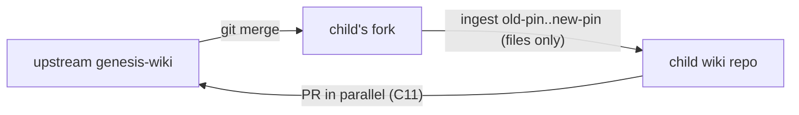

# The Genesis Contract, v1

This document is the reference law for every llm-wiki born from or adopted into the genesis system. Three audiences: agents operating in-wiki, humans reading in Obsidian or a shell, CI enforcing gates. It materializes into every child wiki; a bare reader with `rg` and this file can learn the whole shape.

**Amendment rule for this document itself:** it is contract-owned (manifest-listed). It changes only through the fork-first flow (C11–C12). **Clause numbers are append-only** — a retired clause is marked `RETIRED (superseded by C<n>)`, never renumbered, never deleted; external references to clause numbers must stay valid forever. Every clause also carries a **stable slug**; cite as number + slug per C39.

## Glossary (terms defined once; clauses link here — each entry is one plain sentence a newcomer can parse cold)

- **upstream** — the one public genesis-wiki repo everyone converges on; it holds the reference version of the law.
- **fork** — your wiki's own copy of upstream (an ordinary git fork) where your law changes land first, before being offered back.
- **child wiki** — an actual operating wiki (home, coscene, …): a plain repo you can read with no tools installed.
- **pin** — the single fork commit, written in GENESIS.md, that says "this wiki runs the law as of THIS commit."
- **manifest** — the list inside GENESIS.md naming every file the contract owns, each with its hash and class.
- **materialize** — physically copy the contract's files out of the fork checkout into the wiki, so a bare reader finds them on disk.
- **seed** — a file genesis creates once at birth and never touches again; it is yours from the first second.
- **contract-owned / instance-owned** — on the manifest list = the contract's file (upgrades may replace it); not listed = yours (upgrades never touch it); there is no third state (C6).
- **blind-regen** — pure file replacement gated on the old hash, no agent reads content — the opposite of backfill.
- **backfill** — a change to YOUR authored pages that an amendment requires; an agent does it with eyes open, never as a blind copy.
- **wiki-slug** — the wiki's one name: repo name = folder name = Obsidian vault name. **Wiki context ONLY** — unrelated to (and never mixed with) ucc session slugs or domain slugs; "slug" anywhere in this contract means wiki-slug.
- **repos_root** — the fixed folder every wiki lives under on every machine: `$CCC_LLM_WIKI_REPOS_ROOT/<wiki-slug>`.
- **provenance pin / nav link** — the two kinds of cross-wiki reference: a frozen citation carrying a commit, versus a clickable link to the live page (C24).
- **tiers** — the three moments checks run: while writing, before pushing, and on periodic audit (C32).
- **companion repo** — a separate repo beside a wiki, named `<wiki-slug>-<purpose>`, holding what must not live in the wiki itself (sessions, assets, secrets); its own vault, its own privacy role, its own lint policy (§10).

## §1 Posture

- **C1 `thin-upstream` — Thin upstream.** Genesis ships contract text, checks, and computed-surface definitions. Never content, never a runtime, never shared code. *Why:* anything thicker turns every amendment into a framework migration.
- **C2 `born-once-commit-stream` — Born once, evolved by commits.** Birth scaffolds once and the result is immediately instance-owned; evolution arrives as fork commits ingested by the child — never as a template git-merge into the wiki (see C3).

## §2 Topology & residence

- **C3 `two-repo-rule` — Two-repo rule.** The child wiki repo never merges genesis git history. The fork absorbs upstream via ordinary `git merge` (conflicts resolved there, natively). The wiki ingests only the *file delta* between two fork commits.
- **C4 `fork-residence` — Fork residence.** Each child has its own fork — its operative law. It registers in the child as a git source (role `genesis-upstream`), checkout at `repos_root/<child-slug>-genesis`. The sources entry carries provenance and catalog visibility only; **the pin lives in GENESIS.md** — one owner per fact.
- **C5 `skill-less-floor` — Materialization & the skill-less floor.** Operational contract artifacts materialize into every child: the wiki is a self-describing plain repo. Skill-less READ (and human Obsidian edit) is a *requirement*; skill-less governance (validate/upgrade/mutate) is a *non-goal*.
- **C6 `manifest` — The manifest.** GENESIS.md, in-repo, carries: pin `{fork-remote, fork-commit, upstream-merge-base}` + enumerated contract paths + per-path git blob SHAs + class flags (`contract`|`seed`). Listed → contract-owned; unlisted → instance-owned; **no third state**. Blob SHAs come from git — no separate hash bookkeeping. GENESIS.md lists itself but is **structure-verified, not hash-verified** (it cannot carry its own hash): a schema check replaces the gate for self — the simplest thing that cannot lie.
- **C7 `hash-gate` — Hash gate.** Every overwrite of a `class=contract` path verifies the on-disk file against the *declared pin's* blob SHA first — **the gate covers contract class only; seed paths are never gated** (C8). Dirty → REFUSE + decision page offering: restore / commit-to-fork / adopt-upstream. Never a silent clobber. Blind-overwrite is the *entitlement*; the gate is the license check.
- **C8 `seed-class` — Seed class.** Seed paths are created at birth/adoption and never updated by any upgrade: example clusters, CLAUDE.md template, `inbox/_unstaged/`, `decisions/{pending,accepted,rejected}/`, adv-uri plugin scaffold. Content is the instance's from the first second. The manifest records each seed's **birth-time blob SHA as documentation, never verified after birth** — provenance for "what did birth ship" diffs, not a gate.
- **C9 `schema-governed-exceptions` — Schema-governed exceptions.** `LLM_WIKI.md` is instance-owned but carries a contract-governed block (`reference-wikis`, C21). Its governance is schema-shaped (meridian write-time validation), never hash-shaped; it is never manifest-listed. Same pattern for anything living in `.obsidian/` (Obsidian rewrites it; hashes cannot hold there).
- **C10 `fork-history-immutable` — Published fork history is immutable.** No rebase, squash, or force-push on published fork branches: child pins and trailer walks (C15) depend on stable history.

## §3 Amendment & evolution

- **C11 `fork-first-amendment` — Fork-first amendment.** A contract change lands in the child's fork; the child rematerializes and moves on, never blocked by upstream. A PR to upstream opens in parallel — convergence is a duty, not a gate.
- **C12 `no-change-note-no-merge` — No change-note, no merge.** Every commit touching contract-owned paths carries git trailers: `Change-note:` (required), plus `Blind-regen:` / `Backfill:` / `Backfill-doc:` as applicable, and optionally `Decision-template:`, `Verify:`, `Breaking:`, `Deadline:`, `Severity:`. Upstream CI blocks contract-path diffs without them. **The trailer set is the migration doc** — every amendment is born with its migration.
- **C13 `pin-selected-authority` — Pin-selected authority.** The pin selects which law governs in-wiki. Upstream owns the *reference* law; the fork owns the child's *operative* law; divergence is explicit (fork-ahead commits + open PRs), never forbidden and never silently healed.
- **C14 `pin-writes-cli-owned` — Pin writes are CLI-owned.** Never hand-edited. A lying pin poisons everything downstream.
- **C15 `two-hop-upgrade` — Upgrade = two hops, checkpointed.** (a) *Fork sync:* git merge from upstream, resolved in the fork. (b) *Child ingest:* one whole-range invocation `old-pin..new-pin`; the walk groups commits by trailer — consecutive blind-regen-only commits coalesce into one idempotent step; each backfill-bearing commit is its own checkpoint (rematerialize → backfill → pin bump). **The pin always names a commit whose full effects — files and backfill — are applied.** A killed ingest parks at the last completed checkpoint.
- **C16 `backfills-never-blind` — Backfills are never blind.** Authored-content changes are per-wiki agent work; below-confidence rewrites park in the decision queue (C34).
- **C17 `compat-window` — Compat window.** READ works at any skew, with a banner surfacing both hops (child-behind-fork, fork-behind-upstream). WRITE follows the floor-commit window each ucc release declares (`floor` … `built-against`): refused below floor; a wiki pinned ahead with any `Breaking: true` between = write-refuse until update. Decision pages and append-only logs are version-stable — writable at any skew. UPGRADE is available at any distance.
- **C18 `release-channel` — Release channel.** The llm-wiki skill ships via ucc release; each release carries the genesis commit it was built against + floor (GENESIS-PIN). Genesis materializes `min-ucc` into every child. Preflight is the handshake point: genesis commits compare by ancestor-check (forks are a graph); ucc versions by plain semver (linear tags). `installed < min-ucc` → remind `ucc-cli update` (human-gated by construction).
- **C19 `deadline-machinery` — Deadline machinery.** `Deadline:`/`Severity:` trailers activate it. Baseline is lazy-on-touch; a watchdog sweep + an owned fleet-run walk `repos_root/*` per host (enumeration is local; credentials are needed only to act). One report row per wiki: pass / REFUSED / UNREACHABLE. Never silence.

## §4 Identity & federation

- **C20 `slug-identity` — Slug identity, no mint.** `slug = repo name = repos_root dirname`, claimed in the wiki's own GENESIS.md at birth. Same slug bound to two git URLs anywhere in reach = ERROR. No central registry exists; the fleet view is a computed per-host walk, cached only as an as-of-stamped observation.
- **C21 `reference-block` — Reference block.** `LLM_WIKI.md` frontmatter carries **`wiki-role:` (this wiki's own role)** beside `reference-wikis`: ordered entries `{slug, git, role}` — order is precedence; no paths, no pins (contract lineage is C6's job). One parser (meridian) validates both write-time. Roles form a one-way privacy ladder **`private > team > public`** (`public` is the most-public end — genesis entries use `role: public`). A role names the *information boundary* — who may read, and the repo's writing voice — never scope or topology (that is why there is no `project` role). A wiki may reference equal-or-more-public wikis, never the reverse — enforceable per-block only because `wiki-role:` names the referencing side. The role also mechanically selects the repo's lint pack (C45). Absent block = valid (standalone wiki); present-but-unparseable = ERROR.
- **C22 `realpath-coherence` — Fixed location + realpath coherence.** Every wiki resolves at `repos_root/<slug>` per host; vault name MUST equal slug. Where both a registered vault and `repos_root/<slug>` exist: `realpath(vault) == realpath(repos_root/<slug>)` — symlink in either direction satisfies it; **two distinct copies = ERROR** (audit-truth and click-truth split-brain). No registered vault (agent-only host) = fine.
- **C23 `no-mounts` — No mounts.** No in-vault symlinks, no sync daemons, no snapshot commits. `foreign/` is reserved namespace with an emptiness lint. `wiki sync <slug>` owns ensure-checkout (clone-if-absent at `repos_root/<slug>`; never shallow — blob-filtered OK).
- **C24 `reference-classes` — Two reference classes, one generator.** *Provenance:* `wiki://<slug>/<path>@<commit>` — frontmatter-first as a bare scalar; in body as an inert literal, optionally wrapped as a nav link (drift-checked). Reconstruction: `git -C repos_root/<slug> show <commit>:<path>` — the pin survives anything. *Navigation:* `[display](obsidian://advanced-uri?vault=<slug>&filepath=<path>)` — **meridian-generated only** (`md fix` is the only percent-encoder). The canon defines both the encoding AND the **action selection, deterministically**: fragment present → `advanced-uri`; no fragment → `obsidian://open`. Same input, same output, always — heading/block precision is SHOULD (plugin seeded, doctor-checked, never hash-gated).
- **C25 `ingest-not-reference` — Ingest-not-reference.** The only content flow between wikis is harvest-ingest; the local copy carries the knowledge. Citations bind to immutable tiers (sources/, logs, archives) or the target's domain-index page — never deep evolving leaves.
- **C26 `cross-wiki-audit` — Cross-wiki audit.** My-side (URI edits): pre-push, O(my delta). Their-side (target renames): periodic audit — v1 stateless stat-sweep, findings stamped `as-of:<target-HEAD>`; watermark cursor reserved for scale. Referenced-but-absent repo = ONE finding ("not cloned on this host"), per-URI checks skip that slug. Breakage files as decision pages in the *citing* wiki; no rename propagation.

## §5 Scale & enforcement

- **C27 `prescription-authored` — Prescription authored, description computed.** Enumerations of live state (rosters, counts, catalogs, listings) inside authored pages are violations — embed a computed view instead. Linted enforce-on-new, warn-on-legacy; the lint runs over wikis AND the skill tree. *Why:* migration debt concentrates 100% in authored prose; computed surfaces re-derive free.
- **C28 `computed-surfaces` — Computed surfaces are pull-on-demand caches.** They re-derive from frontmatter + paths (greppable ground truth) and never load at O(corpus). Any index layer (duckdb, datalake) is a rebuildable cache behind a seam — instance-adoptable, never contract.
- **C29 `partition-or-exempt` — Partition or be exempt.** Every unbounded-growth dir declares a partition scheme in SCHEMA (hive `year=/month=` is the model). Post-trio, the primary partition surface is the `-sessions` companion (§10).
- **C30 `raw-tier-exemption` — Raw-tier exemption.** Raw tiers are never full-scanned by blocking checks. This is contract, not tolerance. Wiki-side the raw tier is `inbox/` (plus `sessions/` only until its companion cutover, C47); post-cutover the raw-tier posture attaches to the companion as a *repo boundary* with its own role-selected pack — strictly cleaner than a path exemption. The exemption covers scan *cost* classes only — it never exempts wikilink integrity (C42): there is no tier where a broken link is acceptable.
- **C31 `injection-budget` — Injection budget.** Skill-load injection: pulse ≤ 2K tokens inside a ≤ 10K total cap; catalogs pull-on-demand. "What changed since my last visit" = git delta — O(delta), no stored per-agent state.
- **C32 `enforcement-tiers` — Three enforcement tiers.** Write-time: blocking, touched files only (frontmatter validity, tag format, clause lints on new pages). Pre-push: blocking, O(delta) (zero net-new broken wikilinks, contract hash verify on manifest paths, aggregate invariants). Periodic audit: non-blocking, bounded, owned output (staleness/contradiction, cross-wiki URIs, orphans, decision decay) — findings land as owned decision pages or top-N reports, never warning dumps.
- **C33 `blocking-or-nonexistent` — A check is blocking or it doesn't exist.** Every warn-class rule carries an expiry: graduate to error or be deleted. The ratchet is enforce-on-new / warn-on-touch — never a retroactive warning bomb.
- **C34 `decision-queue-lapse` — Decision queue = objection window.** The action already happened; pending is the window. Machine stubs: TTL ~90d, resurrectable. Human decisions: age surfaces in DIGEST, never closed by silence into rejection — expiry closes to **`lapsed`** (action stands, explicitly unreviewed, never deleted). `severity: high` never lapses — it escalates to C19. Decisions whose referenced paths vanished auto-close `obsolete-by-structure`.

## §6 Fork discipline

- **C35 `pin-reachable-contract-only` — Pin-reachable history is contract-only.** Every commit reachable from any child's pin carries contract amendments only — never instance experiments, content, or scratch work. Scratch *branches* on the fork are git-native and unbannable (C10 protects published branches only); what is banned is scratch entering pin-reachable history. *Why:* trailer walks (C15) and upstream merges must be able to trust every commit they traverse.

## §7 Birth & adoption

- **C36 `adoption-ritual` — Adoption ritual.** An existing wiki enters the contract in one act: (1) **inventory** existing paths; (2) **classify** each as contract / instance / AMBIGUOUS — ambiguities become decision pages, never silent calls; (3) record **baseline SHAs** for everything classified contract; (4) write GENESIS.md + pin, register vault (name = slug), scaffold missing seeds, set up wiki CI. Adopted seeds pre-exist — the manifest marks them `pre-existing` with adopt-time SHA (documentation, same non-gate semantics as C8). *Why:* without a first-class adoption path, wikis #1 and #2 (home, coscene) stay extra-contractual and the boundary becomes archaeology.

## §8 Effects & ownership

- **C37 `effect-pin-lifecycle` — Effect-pin lifecycle.** Every effect the wiki deploys (skill, agent, prompt, site, document) has one descriptor page in `effects/` carrying a pin to the deployed artifact's origin + checksum. Every change to the effect bumps the pin; the audit tier verifies pins resolve and checksums reproduce; a stale or unpinned effect is a finding. *Why:* the descriptor tier is only trustworthy if the pin provably names what is actually deployed.
- **C38 `point-or-own` — Point or own.** Every fact has exactly one owner page; every other page points (wikilink or embed) — never duplicates. Two pages stating the same fact = one must become a pointer (lint, enforce-on-new per C33). *Why:* duplicated law drifts; this is the page-level form of the one-owner-per-fact discipline the contract itself uses (C4, C6).

- **C39 `clause-citation` — Cite by number + slug.** Every clause carries a stable kebab-case slug beside its number. Citations everywhere — skill docs, lints, decision pages, commit trailers — use both: `(contract C34 decision-queue-lapse)`. Slugs never change once published, even if the clause title text evolves; numbers never renumber (preamble). *Why:* a bare number is meaningless at the point of use and silently wrong after any restructure — the dead `references/…§4` pointer was this exact disease.

## §9 Homing & publicity

- **C40 `contract-domain-home` — The contract is a domain in genesis.** Genesis-wiki is itself an llm-wiki whose sole subject is the wiki-of-wikis; the contract text, glossary, and clause lints home there as a domain (not a bare root file — normal llm-wiki conventions apply to genesis too). Children still materialize the operational artifacts (C5); the domain is the source they materialize from.
- **C41 `genesis-public` — Genesis upstream is public.** Clonable, GitHub-Pages publishable, maximally accessible. **No private content ever lands in upstream** — no instance data, no credentials, no personal or team knowledge; C35 keeps pin-reachable history contract-only and upstream PR review enforces the same bar. Child wikis and their forks may be private; publicity is one-way — upstream sits at the most-public end of the C21 DAG, so every wiki may reference genesis.
- **C42 `wikilink-is-a-claim` — A wikilink is a claim the target matters.** No coverage-exemption tier exists for wikilinks — not raw tiers, not legacy pages. If the link is meaningful, fix it; if it is not, de-link to plain text. A link nobody would fix is a claim nobody stands behind.

## §10 Companion repos

- **C43 `companion-grammar` — One naming grammar, no registry.** A companion repo is named `repos_root/<wiki-slug>-<purpose>` — derivable from the wiki-slug alone, resolvable with zero lookup, consistent with C20/C22. Each companion is a full repo boundary: its own vault (where humans view; assets/secrets are typically vault-less — the C22 agent-only carve-out applies per repo), its own role, its own lint pack. Optional companions follow the same grammar (live precedent: `home-wiki-repos` already exists in the wild — this clause ratifies, not invents). Grammar ambiguity is an ERROR class: a *wiki* whose own slug parses as `<known-wiki-slug>-<purpose>` collides with the companion namespace — doctor flags it beside C20 collisions.
- **C44 `claimed-trio` — Three claimed primitives per wiki.** Every wiki claims `<slug>-sessions` (ccc-compound session artifacts), `<slug>-assets` (file assets), `<slug>-secrets` (sops-managed service access). **Claimed at birth, created on first need** — the names are reserved by grammar; an absent trio member is normal (doctor: INFO, never a warning). **All companions, trio included, inherit the wiki's role by default** (`meridian.yaml role:` overrides if ever needed). There is no `-secrets` special case: decrypted content is outside contract jurisdiction (decryption is runtime, age keys are unmanaged by contract), and the sops-visible surface — key names, recipient pubkeys — is the same sensitivity class as plaintext wiki text, so "who may read" is the question the role already answers; key-name hygiene is ordinary plaintext discipline under the role's existing pack. *Why:* the jsonl secrets incident — session artifacts carrying private material need a home whose privacy policy matches the material, not the wiki's.
- **C45 `role-selects-lint-pack` — The role IS the policy selector.** Every repo declares its role in exactly one place: a wiki in `LLM_WIKI.md wiki-role:`, a companion in its `meridian.yaml role:` (declaring in both = drift ERROR). The role mechanically selects the lint pack: **private** → secrets permitted in-repo (highest-privacy class; leak-in-repo tolerated, the remote itself stays private; no secret-scan); **team** → secrets blocked by pre-commit hook; **public** → team pack + external-voice boundary, of which lint enforces the *mechanical subset* (internal-endpoint patterns, DAG check, audience frontmatter) — voice itself is a norm the pack cannot fully mechanize, and this clause does not pretend otherwise. Hook install is part of ensure-checkout/birth: **a team or public repo never has an unhooked window.** One repo, one policy — policy attaches to repo boundaries, never to subtrees.
- **C46 `bases-move-with-data` — Views live with their data.** A `.base` view joining a repo's data lives in that repo (session-joining views move into `<slug>-sessions`). This is mechanical necessity, not preference: **Obsidian bases cannot query across vaults** — a view separated from its rows is dead. Adopt the tool's constraints; a view reaching across a repo boundary is a design smell.
- **C47 `cheap-cutover` — Migration is cheap by decree.** Companion adoption is a forward cutover: repoint the path resolution, bulk string-change whatever needs repointing, in one commit gated by a zero-broken-links verify. History migration means nothing; preserving old link topology is a non-goal. **Order is contract:** the canonical cross-repo reference form (C48) exists *before* any repoint — never bulk-edit twice — and same-change cleanup of now-dead config (rule exclusions, exemption entries, stale doc pointers) rides the cutover commit, or the sediment lesson repeats.
- **C48 `companion-addressability` — Companions are wiki://-addressable.** A companion slug is just a slug (C20): `wiki://<wiki-slug>-sessions/<path>@<commit>` works with zero new grammar — C24's provenance class and C26's audit apply unchanged. Once sessions leave the vault, wiki→session references are cross-repo by definition and use this form (frontmatter-first per C24); the companion commit must exist before a wiki page cites it `@commit` — **companion commits first, wiki second** (independent repos, no gitlink). **Implicit-trio rule:** the URI audit accepts a wiki's own `<slug>-{sessions,assets,secrets}` without a `reference-wikis` entry — derivable names are never declared (C43); non-trio companions likewise resolve by grammar. The C21 privacy DAG governs *reference grammar only* — a prose mention of a more-private path is a voice-norm matter for the role's pack (C45), not a DAG violation.

## Drafting rulings (draft 3 — all reviewing lanes concur; panel rulings)

1. **GENESIS.md self-hash** → ruled: exclude-self + schema check (folded into C6).
2. **Seed hash semantics** → ruled: birth-time SHA as documentation, never a gate (C8); adopt-time = `pre-existing` marker (C36).
3. **Fork scope** → ruled final phrasing: pin-reachable history is contract-only (C35).
Draft-2 deltas: C21 `wiki-role:` placement, C24 deterministic action selection, C7 contract-class-only gating (meridian).
Draft-3 additions: C36 adoption ritual (coscene lane), C37–C38 effect-pin lifecycle + point-or-own (skill lane — closes the skill-cites-nonexistent-law defect class).
Draft-4 additions (user sort-rework req 1): stable slugs on all clauses + C39 `clause-citation` convention (self-describing).
Draft-5 (user rulings D-c/D-d + meridian): glossary rewritten plain-language; `slug` scoped to wiki-slug (ucc collision named); C21 enum gains `public` tier (genesis = role:public — without it every team→genesis reference mis-lints); §9 added — C40 contract-domain-home, C41 genesis-public, C42 wikilink-is-a-claim (supersedes any link-coverage exemption reading of C30).
Draft-6 (R11 user directive, companion repos): C21 enum reworked to `private > team > public` (supersedes draft-5's 5-tier — role names the information boundary, not scope; `project`/`home`/`secret` die as roles); §10 added — C43 companion-grammar, C44 claimed-trio, C45 role-selects-lint-pack, C46 bases-move-with-data, C47 cheap-cutover, C48 companion-addressability. Lint-pack contents + cutover sequencing are lane deliverables (meridian, ucc lanes), not contract text.
Draft-6 lane feeds folded (all five lanes): C48 added — wiki:// addressability + implicit-trio + companions-commit-first + DAG-governs-grammar-only (skill, meridian, coscene lanes); C45 role placement split + no-unhooked-window + honest voice limit (meridian, ucc lanes); C44 claimed-at-birth/created-on-first-need + role-inheritance defaults with `-secrets` open param (meridian, coscene lanes); C43 vault-less carve-out + greedy-parse collision + home-wiki-repos precedent (meridian, home lanes); C46 cross-vault WHY; C47 form-before-repoint ordering + same-change config cleanup (ucc, coscene lanes); C29/C30 re-homed to companion boundaries.
Draft-7 (user ruling, closes the last open param): the `-secrets` special case **dissolves** — one inheritance rule for all companions (folded into C44). Rationale recorded in the clause itself; a special case that dissolves under inspection dies in the text, not gets an answer recorded. **Draft 6 user-approved; draft 7 carries only this change.**
